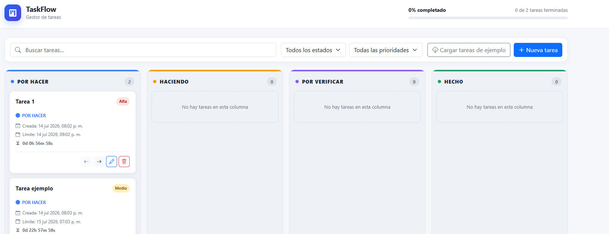
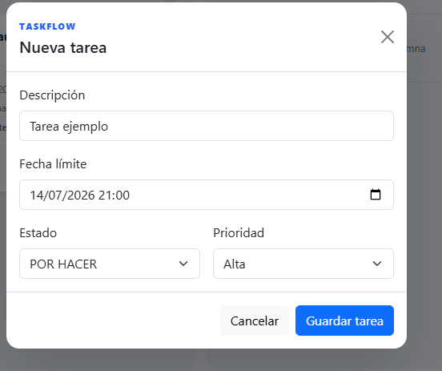
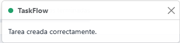
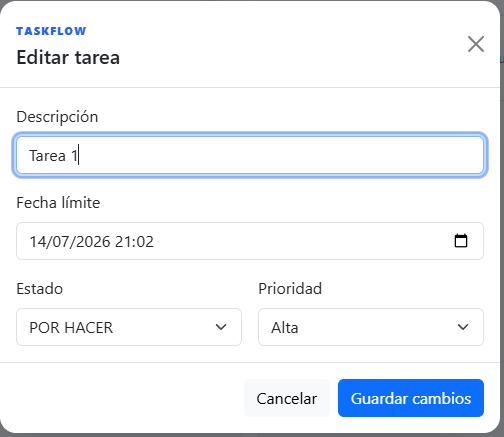

# TaskFlow

TaskFlow es una aplicación web de gestión de tareas basada en un tablero Kanban. Permite organizar el trabajo en cuatro etapas, definir prioridades y fechas límite, filtrar tareas y conservar toda la información en el navegador.

El proyecto fue desarrollado con JavaScript moderno, orientación a objetos y manipulación dinámica y segura del DOM.


## Vista general

El flujo de trabajo se organiza de la siguiente manera:

```text
POR HACER ⇄ HACIENDO ⇄ POR VERIFICAR ⇄ HECHO
```

Las tareas pueden avanzar o retroceder mediante sus botones de acción. En equipos de escritorio también pueden arrastrarse directamente entre columnas.

## Funcionalidades

- Crear y editar tareas desde un modal reutilizable.
- Eliminar tareas.
- Avanzar y retroceder entre estados.
- Mover tarjetas entre columnas mediante drag and drop.
- Asignar prioridad alta, media o baja.
- Definir una fecha límite opcional.
- Mostrar un contador regresivo actualizado en tiempo real.
- Identificar visualmente las tareas vencidas.
- Buscar por descripción o estado.
- Filtrar por estado y prioridad.
- Calcular el porcentaje general de tareas completadas.
- Mostrar la cantidad de tareas de cada columna.
- Guardar automáticamente los cambios en `localStorage`.
- Recuperar los datos como instancias reales de la clase `Tarea`.
- Cargar tareas de ejemplo desde JSONPlaceholder.
- Mostrar notificaciones mediante toasts.
- Adaptarse a computadores, tablets y teléfonos.

## Tecnologías

- HTML5 semántico.
- CSS3, CSS Grid y Flexbox.
- Bootstrap 5.3.
- Bootstrap Icons.
- JavaScript ES6+.
- Fetch API.
- Web Storage API.
- JSONPlaceholder.

## Conceptos de JavaScript aplicados

- Clases, objetos e instanciación con `new`.
- Módulos ES6 con `import` y `export`.
- `const`, `let`, arrow functions y template literals.
- Destructuring y operadores spread/rest.
- Eventos `submit`, `click`, `keyup`, `change`, `mouseover` y drag and drop.
- Manipulación del DOM con `createElement()`, `textContent`, `append()` y `replaceChildren()`.
- `setTimeout()` para simular el proceso de creación.
- Un único `setInterval()` para actualizar los contadores.
- `fetch()`, `async/await`, `try/catch` y comprobación de `response.ok`.
- Persistencia con `JSON.stringify()` y `JSON.parse()`.

## Estructura del proyecto

```text
.
├── index.html
├── README.MD
└── assets
    ├── css
    │   └── style.css
    ├── img
    │   ├── EditarTarea.png
    │   ├── NuevaTarea.png
    │   ├── TableroTareas.png
    │   └── TareaGuardada.png
    └── js
        ├── script.js
        └── clases
            ├── GestorTareas.js
            └── Tarea.js
```

### Responsabilidad de los archivos

- `index.html`: encabezado, herramientas, tablero, modal y toast.
- `assets/css/style.css`: apariencia del Kanban, estados visuales y diseño responsive.
- `assets/img`: capturas utilizadas en la documentación del proyecto.
- `assets/js/clases/Tarea.js`: modelo, validaciones y comportamiento de una tarea.
- `assets/js/clases/GestorTareas.js`: administración de la colección, CRUD, filtros y estados.
- `assets/js/script.js`: renderizado, eventos, persistencia, temporizadores y comunicación con la API.

## Instalación y ejecución

El proyecto no requiere instalar paquetes ni ejecutar un proceso de compilación. Como utiliza módulos ES6, debe servirse mediante HTTP.

1. Clona el repositorio:

   ```bash
   git clone https://github.com/RicardoNavarreteDev/Proyecto-ABP-M4.git
   ```

2. Abre la carpeta del proyecto en Visual Studio Code.
3. Inicia un servidor local, por ejemplo con la extensión **Live Server**.
4. Abre la dirección indicada por el servidor, normalmente:

   ```text
   http://127.0.0.1:5500
   ```

También puedes utilizar cualquier otro servidor estático. No se recomienda abrir `index.html` directamente mediante `file://`.

## Uso

### 1. Explora el tablero

El tablero distribuye las tareas entre **POR HACER**, **HACIENDO**, **POR VERIFICAR** y **HECHO**. En la parte superior se encuentran el buscador, los filtros, la carga de ejemplos y el botón de creación.



### 2. Crea una tarea

Presiona **Nueva tarea** y completa la descripción, fecha límite, estado y prioridad. La descripción es obligatoria.

<p align="center">
  
</p>

Después de guardar, TaskFlow simula un proceso de dos segundos y confirma la creación mediante una notificación.

<p align="center">
  
</p>

### 3. Edita una tarea

Selecciona el botón con el icono de lápiz. El mismo modal permite modificar la información sin cambiar el identificador de la tarea.

<p align="center">
  
</p>

### 4. Organiza el flujo

Utiliza las flechas de cada tarjeta para avanzar o retroceder. En computadores también puedes arrastrar una tarjeta directamente a otra columna. El buscador y los filtros permiten localizar tareas por descripción, estado o prioridad.

Todos los cambios se guardan automáticamente en el navegador.

## Publicación en GitHub Pages

Este proyecto puede publicarse directamente desde la raíz de la rama `main`:

1. Abre el repositorio en GitHub.
2. Entra en **Settings → Pages**.
3. En **Build and deployment**, selecciona **Deploy from a branch**.
4. Elige la rama `main` y la carpeta `/ (root)`.
5. Presiona **Save** y espera a que GitHub genere la publicación.

La aplicación quedará disponible en:

```text
https://ricardonavarretedev.github.io/Proyecto-ABP-M4/
```

## Persistencia

Las tareas se almacenan en `localStorage` bajo la clave `taskflow-tareas`. Al recargar la página, los objetos se reconstruyen mediante `Tarea.desdeObjeto()`, por lo que conservan sus métodos.

Las fechas se almacenan internamente en formato ISO 8601 y se formatean únicamente al mostrarse. Las tareas creadas con versiones anteriores también son compatibles: el estado booleano `false` se convierte en `todo` y `true` en `done`.

Para borrar todos los datos locales del tablero, elimina la clave `taskflow-tareas` desde las herramientas de desarrollo del navegador.

## API de ejemplo

El botón **Cargar tareas de ejemplo** consulta:

```text
https://jsonplaceholder.typicode.com/todos
```

La aplicación recupera un máximo de seis tareas, adapta los datos externos al modelo de `Tarea`, evita identificadores duplicados y guarda los resultados en `localStorage`.

Si la petición falla, se muestra una notificación y las funcionalidades locales continúan disponibles.

## Accesibilidad y seguridad

- Los controles de formulario cuentan con etiquetas accesibles.
- Los botones que muestran solo iconos incluyen `title` y `aria-label`.
- El modal administra el foco y puede cerrarse con teclado.
- Las notificaciones utilizan regiones `aria-live`.
- Las tarjetas son enfocables mediante teclado.
- Los colores se acompañan de nombres de estado y prioridad.
- El contenido ingresado por el usuario se inserta mediante `textContent`; no se utiliza `innerHTML`.
- Las acciones dinámicas utilizan delegación de eventos para evitar listeners duplicados.

## Consideraciones

- JSONPlaceholder se utiliza únicamente para obtener datos de demostración.
- El drag and drop nativo puede variar entre navegadores móviles; los botones de avanzar y retroceder ofrecen una alternativa accesible.
- Bootstrap y Bootstrap Icons se cargan desde CDN, por lo que su carga inicial requiere conexión a internet.

## Autor

Ricardo Navarrete.
